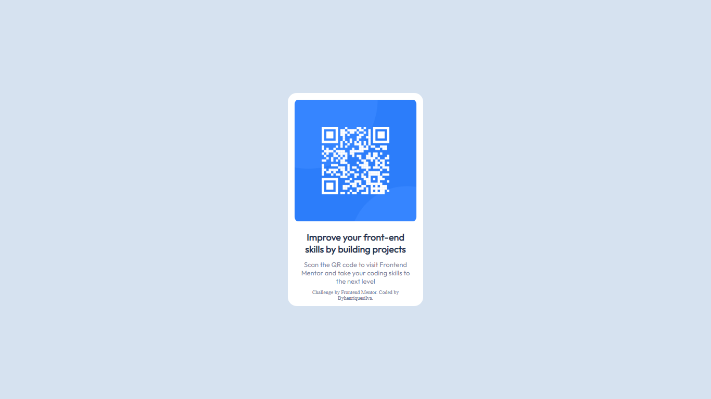

# Frontend Mentor - solução de componente de código QR

Esta é uma solução para o [desafio do componente de código QR no Frontend Mentor](https://www.frontendmentor.io/challenges/qr-code-component-iux_sIO_H). Os desafios do Frontend Mentor ajudam você a melhorar suas habilidades de codificação criando projetos realistas.

## Índice

- [Visão geral](#visão-geral)
  - [Captura de tela](#captura-de-tela)
  - [Links](#links)
- [Meu processo](#meu-processo)
  - [Construído com](#construído-com)
  - [O que aprendi](#o-que-aprendi)
  - [Desenvolvimento contínuo](#desenvolvimento-contínuo)
  - [Recursos úteis](#useful-resources)
- [Autor](#autor)
- [Agradecimentos](#agradecimentos)

**Observação: exclua esta nota e atualize o índice com base nas seções que você mantém.**

## Visão geral

### Captura de tela



### Links

- URL da solução: [Site da solução](https://www.frontendmentor.io/solutions/pgina-responsiva-com-o-qr-code-do-site-frontend-mentor-CpUBgcbaT3)
- URL do site ao vivo: [Site ao vivo](https://byhenriquesilva.github.io/Qr-code/)

## Meu processo

### Construído com

- Marcação HTML5 semântica
- Propriedades personalizadas de CSS
- Flexbox
- Grade CSS

### O que eu aprendi

A partir desse projeto compreendi de forma mais clara a propriedade do css display:flex, aprendendo como alinhar horizontalmente e verticalmente. Também consegui aperfeiçoar minha habilidade no css. 

``` css
.conteiner {
    display: flex;
    flex-direction: column;
    justify-content: center;
    align-items: center;
}
```

### Desenvolvimento contínuo

Para desenvolvimento contínuo pretendo continuar aperfeiçoando meus conhecimentos em css e começar a estudar JavaScript.

### Recursos úteis

-(https://developer.mozilla.org/pt-BR/docs/Web/CSS/CSS_Flexible_Box_Layout/Aligning_Items_in_a_Flex_Container) - Este é um artigo incrível que me ajudou a finalmente para que serve as propriedades justify-content e align-items. Eu recomendo para quem ainda está aprendendo este conceito.

## Autor

- Site - [Henrique Silva](https://profilehs.netlify.app/)
- Mentor de frontend - [@byhenriquesilva](https://www.frontendmentor.io/profile/byhenriquesilva)
- Github - [@byhenriquesilva](https://github.com/byhenriquesilva)

## Agradecimentos

Agradecer primeiramente a Deus, agradecer a Frontend Mentor por essa oportunidade de praticar e melhorar minnhas habilidades e agradecer a todos que me ejudaram e me apoiaram na  construção desse projeto.
